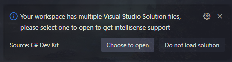

# SurWeaver + Utility = Surtility

## Предназначение

Данная библиотека создана и используется мной для игрового проекта на [MonoGame](https://monogame.net/) с использованием библиотеки [ecslite](https://github.com/Leopotam/ecslite).

Кроме инструментов по работе с MonoGame и ecslite, в библиотеке находятся **полезные вещи для более широкого применения**. Я переписал ease-функции полезные для плавных анимаций, а также добавил bat-скрипт по созданию проекта на MonoGame с подключением необходимых библиотек.

Изначально это было и является моим локальным решением, которое не претендует на что-то конкурентноспособное (учитывая то, что этот набор и так достаточно специфичен, чтобы были какие-то аналоги).

## Содержимое библиотеки

* **Генератор сущностей** с цепным вызовом функций (Tools) (примеры ниже);
* Функция расширения, позволяющая добавлять компоненты через Pool'ы в одну строку (Extensions);
* Функция расширения, позволяющая получать компонент с одиночной сущности в фильтре (Extensions);
* Системы+компоненты для использования deltaTime внутри своих систем (Timing);
* Системы+компоненты для простого рисования спрайтов (Drawing);
* Система ввода (Input);
* Переписанный на **C# набор ease-функций** с сайта https://easings.net/ для Tween-анимаций (Tweening);
* **bat-скрипт, создающий проект на MonoGame с подключением этой библиотеки и ecs-фреймворка** (в корне проекта, можно переделать под себя);

## Как заставить это работать у себя

Скачать проект и поместить его в удобное место на компьютере.
Я для себя завёл папку на диске `D:\ForeignProjects` (т.е. чужие проекты).

Дальше алгоритм разветвляется на два подпункта ниже:

### Хочу добавить в существующий проект

Заходим в свой проект, открываем в терминале VS Code папку проекта и там вводим команду:

```
dotnet add reference D:\ForeignProjects\Surtility\Surtility\Surtility.csproj
```
Провозглашение словно троекратное "ура"!

**Или** же просто добавляем в .csproj-файл следующие строки:
```
  <ItemGroup>
    <ProjectReference Include="D:\ForeignProjects\Surtility\Surtility\Surtility.csproj" />
  </ItemGroup>
```


### Хочу сделать новый проект да так, чтобы можно было клепать эти проекты по щелчку пальца!

Ооо, а вас затянуло!

У меня для вас есть скрипт, который потребует наличия установленного [dotnet](https://dotnet.microsoft.com/en-us/), шаблонов [MonoGame](https://monogame.net/) (кои вы можете скачать и установить по ссылке), а также настроенного [Git'а](https://git-scm.com/).

Для удобства у себя на компьютере можно завести некую папку `Scripts`, где будет содержаться мой и любые ваши скрипты, если вас и это затянет.

В пуске ищем "Изменение системных переменных среды". Можно быстро найти по части слова, например, "перем".
В "PATH" добавляем нашу созданную папку.

Помещаем в эту папку файл `CreateEcsMonoGameProject.bat` из корня этого репозитория.

Заходим в папку, где будет лежать папка проекта (т.е. если вы хотите, чтобы проект располагался в `D:/Projects/MyCoolProject`, то необходимо зайти в папку `D:/Projects` и НЕ создавать папку `MyCoolProject`).

Далее вы можете через ПКМ "Открыть в терминале" текущую папку. Скрипт работает из PowerShell и обычной командной строки.

Необходимо ввести:
```
CreateEcsMonoGameProject <НазваниеПроектаБезПробеловДаИБезСкобокТоже>
```

Скрипт создаёт решение с 2 проектами, игра от MonoGame и библиотека классов, также в папке с решением будет присутствовать библиотека Surtility. Это позволит просматривать код библиотеки, а также ставить в ней работающие точки останова (Breakpoint'ы). Так как это реализовано через под-модули Git'а, скрипт инициализирует пустой репозиторий, в который внедряет этот модуль.

Также скрипт в конце алгоритма собирает проект и открывает его в Visual Studio Code.

> ОБРАТИТЕ ВНИМАНИЕ! Из-за этого у вас в рабочей папке находится более одного файла решения (.sln), ваша настроенная среда разработки может попросить указать главное решение, выбирайте Main, а не Surtility. Иначе подсказки в коде работать не будут, библиотеку Surtility не будет видно.

Пример уведомления:




После ввода команды вы можете увидеть подобный вывод, если всё правильно настроено:
```
D:\Work\Projects>CreateEcsMonoGameProject MyProject
Шаблон "Файл решения" успешно создан.

Шаблон "Библиотека классов" успешно создан.

Идет обработка действий после создания...
Восстановление D:\Work\Projects\MyProject\MyProject.Core\MyProject.Core.csproj:
Восстановление выполнено.


Шаблон "MonoGame Cross-Platform Desktop Application" успешно создан.

Идет обработка действий после создания...
Восстановление D:\Work\Projects\MyProject\MyProject.Main\MyProject.Main.csproj:
Восстановление выполнено.


Initialized empty Git repository in D:/Work/Projects/MyProject/.git/
Cloning into 'D:/Work/Projects/MyProject/Surtility'...
remote: Enumerating objects: 192, done.
remote: Counting objects: 100% (192/192), done.
remote: Compressing objects: 100% (115/115), done.
remote: Total 192 (delta 85), reused 170 (delta 63), pack-reused 0 (from 0)
Receiving objects: 100% (192/192), 37.13 KiB | 413.00 KiB/s, done.
Resolving deltas: 100% (85/85), done.
warning: in the working copy of '.gitmodules', LF will be replaced by CRLF the next time Git touches it
Проект "MyProject.Core\MyProject.Core.csproj" добавлен в решение.
Проект "MyProject.Main\MyProject.Main.csproj" добавлен в решение.
Проект "Surtility\Surtility\Surtility.csproj" добавлен в решение.
Ссылка "..\Surtility\Surtility\Surtility.csproj" добавлена в проект.
Ссылка "..\MyProject.Core\MyProject.Core.csproj" добавлена в проект.
Восстановление завершено (0,6 с)
  ecslite успешно выполнено (0,0 с) → D:\ForeignProjects\ecslite\bin\Debug\net8.0\ecslite.dll
  Surtility успешно выполнено (0,2 с) → Surtility\Surtility\bin\Debug\net9.0\Surtility.dll
  MyProject.Core успешно выполнено (0,3 с) → MyProject.Core\bin\Debug\net9.0\MyProject.Core.dll
  MyProject.Main успешно выполнено (0,8 с) → MyProject.Main\bin\Debug\net9.0\MyProject.Main.dll

Сборка успешно выполнено через 1,4 с

Доступны обновления рабочей нагрузки. Для получения дополнительных сведений запустите `dotnet workload list`.
Project MyProject successfully created!
```

Весь скрипт прокомментирован и поделён на блоки, можете отредактировать на своё усмотрение в любом текстовом редакторе!

## Примеры использования кода

### Генератор сущностей

Это статический класс, используемый для массового добавления компонентов на новую или существующую сущность.

```csharp
// Инициализация после создания ECS-мира, потому что он нужен для создания новых сущностей
EntityGenerator.Initialize(_ecsWorld);

...

// Непосредственное применение - создание сущностей
EntityGenerator.NewEntity()
    .With(new GridSize() { Point = new(64) });

// Сохранение entity в переменную с помощью функции "End"
int playerEntity = EntityGenerator.NewEntity()
    .With(new PlayerMarker())
    .With(new Sprite(_playerTexture))
    .With(new Coordinate(2, 3))
    .With(new FrameCount(5))
    .With(new CurrentFrame(2))
    .End();

// Добавление новых компонентов в существующую сущность
EntityGenerator.FillEntity(playerEntity)
    .With(new OnFire())
    .With(new EffectDuration(3f));
```

Лучше оставлять явным определение внутренних полей без конструктора, когда неочевидно, какое значение находится внутри. Альтернативный способ - явно указывать имена параметров:

```csharp
var firstPlayer = EntityGenerator.NewEntity()
    .With(new Player())
    .With(new PlayerIcon(firstPlayerIcon))
    .With(new CursorIcon(firstPlayerCursor, origin: new(16)))
    .With(new Figure(firstPlayerSign))
    .With(new FigureTexture(firstPlayerFigure, frameCount: 8))
    .With(new SpriteColor(Color.Green))
    .End();
```

### Расширение Pool

В исходном виде, для того, чтобы добавить компонент к сущности с заданными значениями, необходимо написать следующее:

```csharp
ref Component1 c1 = ref pool.Add(entity);
с1.Value = 42;
```

Когда компонентов и/или полей внутри компонентов несколько, то код сильно разрастается.

Предлагаемый вариант изолирует присвоение компоненту нужного значения внутри функции:

```csharp
pool.Add(entity, new Component1() { Value = 42 });
// или
pool.Add(entity, new Component1(42));
// если решили сделать конструктор
```

### Чутка кривое расширение Filter

Если вам, как и мне, хочется хранить единственную сущность, которая будет хранить важную для других сущностей информацию, то этот способ сократит и спрячет некрасивый код, ведь фильтры и их enumerator'ы предназначены для прохождения по множеству значений, а мы помещаем единственную сущность с одним или более компонентами.

В таком случае хотелось бы более ёмкий вариант написания этого.

Представим, что у нас следующие пулы и фильтры для работы системы.
```csharp
// Эта пара фильтрует и даёт доступ к набору игровых NPC (код сугубо надуманный)
private EcsFilter _npcFilter;
private EcsPool<Npc> _npcPool;

// Эта пара фильтрует и даёт доступ к единственной сущности с данными, нужными для набора NPC,
// которым эти данные нужны для калькуляции (например, там хранится сила гравитации)
private EcsFilter _worldSettingFilter;
private EcsPool<WorldSetting> _worldSettingPool;
```

В данном случае метод `Run` содержит следующие строки:
```csharp
public void Run(IEcsSystems systems)
{
    var settingEntityCount = worldSettingFilter.GetEntitiesCount();

    if (settingEntityCount > 1)
        throw new Exception("Дубликат настроек мира!");
    if (settingEntityCount < 1)
        throw new Exception("Настройки мира отсутствуют!");

    WorldSetting setting;
    foreach (var entity in worldSettingFilter)
    {
        setting = _worldSettingPool.Get(entity);
        // Опционально можно поместить break для перестраховки, что код считает только 1 сущность.
        // Хотя лучше предотвратить неправильное количество сущностей,
        // чем исправлять ошибки потом во всех остальных местах.
        break;
    }

    // * Дальнейшая логика с NPC *
}
```

Есть более читабельная альтернатива циклу:
```csharp
WorldSetting setting;
var entityCount = filter.GetEntitiesCount();
if (entityCount != 1)
{
    throw new Exception("Неправильное количество сущностей: " + entityCount.ToString());
}

foreach (var entity in _filter)
{
    setting = _worldSettingPool.Get(entity);
    break;
}
```

Вот же предлагаемая альтернатива и пример её использования из этого же репозитория.

Файл `UpdateTweenTimeSystem.cs`:

```csharp
public void Run(IEcsSystems systems)
{
    if (_tweenFilter.GetEntitiesCount() < 1)
        return;

    var deltaTime = _dtFilter.GetSingleEntityComponent(_dtPool).Seconds;

    foreach (var entity in _tweenFilter)
    {
        ref var tween = ref _tweenPool.Get(entity);

        tween.CurrentTime = Math.Min(tween.CurrentTime + deltaTime, tween.Duration);
        tween.Percent = (float)(tween.CurrentTime / tween.Duration);
    }
}
```

Важный комментарий после некоторого времени работы с этим:
> Данный код с DeltaTime я исправил на `static` класс. Я всё ещё изучаю ECS, поэтому это расширение пока немного поживёт. Если не найдётся настоящего случая, где это понадобится, я удалю этот `Extension`-метод.

## Ввод (Клавиатура, мышь, геймпад)

Я добавил свои классы, работающие с оригинальными классами Mouse, Keyboard и GamePad, чтобы добавить достаточно распространённый стандартный функционал (была ли только что нажата кнопка/клавиша, насколько курсор мыши переместился по отношению к предыдущему кадру).

> Личная заметка: оригинальный API, работающий с устройствами поразительно непостоянен в плане списка функций. У клавиатуры и геймпада (а именно - у их состояний) есть свои методы на проверку, в каком состоянии каждая из кнопок: отпущена или нажата. У мыши почему-то это отсутствует, однако внутреннее устройство сохранения данных достаточно похоже.

Поэтому я предоставляю достаточно простые классы с постоянным, одинаковым именованием функций.

Предоставляемые классы сохраняют состояние предыдущего кадра и текущего. Это позволяет узнать, была ли только что нажата или отпущена клавиша/кнопка, а также отслеживает перемещение курсора мыши (текущее положение и разница с предыдущим кадром), текущая прокрутка колеса мыши.

> Каждый из контроллеров имеет Update-метод, после которого все проверки на пользовательский ввод актуальны ровно на текущий кадр! Не забываем обновлять каждый кадр!

### Клавиатура

```cs
public class KeyboardController
{
    ...

    // Обновляем каждый кадр, помещая перед всей логикой игры
    public void Update();

    // Проверка на ввод осуществляется через следующие функции по перечислению клавиш из XNA
    public bool IsPressed(Keys key);
    public bool IsJustPressed(Keys key);
    public bool IsReleased(Keys key);
    public bool IsJustReleased(Keys key);
}
```

### Мышь

Кроме проверок на ввод кнопок мыши контроллер содержит данные о позиции курсора и прокрутке колеса мыши.

```cs
public class MouseController
{
    ...

    // Обновляем каждый кадр, помещая перед всей логикой игры
    public void Update();

    // Текущая позиция курсора
    public Point MousePosition { get; }

    // Позиция курсора относительно предыдущего кадра
    public Point MouseDeltaPosition { get; }

    // Текущее значение прокрутки колеса мыши
    public int CurrentScroll { get; }

    // Проверка на ввод осуществляется через следующие функции по собственному перечислению кнопок мыши
    // Имеющиеся кнопки - левая, правая, центральная и 2 боковые
    public bool IsPressed(MouseButton button);
    public bool IsJustPressed(MouseButton button);
    public bool IsReleased(MouseButton button);
    public bool IsJustReleased(MouseButton button);
}
```

### Геймпад

Контроллер создаётся на каждый подключенный геймпад. Можно явно выставить это при создании контроллера.

```cs
public class GamePadController
{
    // При создании контроллера геймпада по умолчанию подразумевается первый слот геймпада.
    public GamePadController(PlayerIndex playerIndex = PlayerIndex.One);

    // Обновляем каждый кадр, помещая перед всей логикой игры
    public void Update();

    // Подключен ли этот геймпад
    public bool IsConnected();

    // ControllerSide - собственное перечисление со значениями Left и Right.
    // Положение стика
    public Vector2 GetStickValue(ControllerSide side);
    // Процентное значение нажатия курков (от 0 до 1) (те самые (LT,RT)/(L2,R2) на геймпаде)
    public float GetTriggerValue(ControllerSide side);

    // Проверка на ввод осуществляется через следующие функции по перечислению кнопок геймпада из XNA
    public bool IsPressed(Buttons button);
    public bool IsJustPressed(Buttons button);
    public bool IsReleased(Buttons button);
    public bool IsJustReleased(Buttons button);

    // Задаём вибрацию (левый мотор - низкочастотный, правый - высокочастотный). Сбрасывать вибрацию необходимо самостоятельно
    public void SetVibration(float leftMotor, float rightMotor);
}
```

## Tween-анимации

Проект содержит соответствующие компоненты и системы для запуска плавных анимаций.

Текущая реализация опирается на реализованные здесь же систему+компонент с временем текущего кадра, которая тянется из MonoGame.

При добавлении этих систем вы можете создавать анимации конкретного типа (например, double, float, Vector2 и т.д.), а затем привязываться к `TweenCurrentValue<ВашТип>`, чтобы переносить результат анимации на нужный вам компонент в своей системе.

Порядок выполнения систем:
* `Timing.UpdateDeltaTimeSystem` (обновили deltaTime);
* `UpdateTweenTimeSystem` (обновили время у всех tween-анимаций);
* `UpdateTweenValueSystem<КаждыйТипКоторыйВыАнимируете>` (обновили значения конкретного типа);
* `AnimateComponentSystem<TComponent, TValue>` (перенесли значения из анимаций на свои компоненты);
* `CleanTweenSystem` (удаляет все tween-компоненты + ваши кастомные, которые туда передадите).

## Drawing

В этом решении размещено моё сугубо локальное решение, которое я планирую использовать для отрисовки моей 2д-игры. Мой подход - малое количество кадров, которые обозначают конкретные состояния объектов и tween-анимации, передающие правильные эмоции, ощущения, "продающие" текущее движение.

Порядок выполнения систем:
* `CreateSpriteFrameSystem` (для создания компонента CurrentFrame)
* `CreateSpriteBorderSystem` (для создания прямоугольника на текстуре, который будет отображаться)
* `DrawSpriteSystem` (рисование спрайта)

Что эта система позволяет?

Пример: для создания анимации мы можем взять текстуру с несколькими изображениями, расположенных по горизонтали. Мы указываем FrameCount, соответствующий количеству кадров в изображении.

Вот пример создания сущности с нужными компонентами:
```cs
_entityGenerator.NewEntity()
    // Эти два тут для примера
    .With(new PlayerMarker())
    .With(new Coordinate(2, 3))
    // Все компоненты ниже используются вышеупомянутыми системами рисовки
    .With(new Sprite(_playerTexture))
    .With(new FrameCount(5))
    // CurrentFrame можно не указывать, т.к. одна из систем создаёт его с нулём у сущностей с FrameCount
    .With(new CurrentFrame(2));
```

Системы создают вспомогательный компонент `SpriteBorder`, который описывает отображаемый регион спрайта. Для смены кадра можно изменить `CurrentFrame` и очистить `SpriteBorder` после отрисовки (например, в `PostRun`-методе системы).

## Комментарий

Все эти решения используются мной. По мере развития собственного проекта и бОльшего применения данных инструментов я буду их улучшать и увеличивать их количество.
